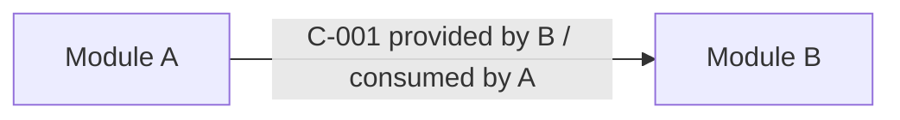

# Cross-Module Contract SDD

## 定位

这是 `cross-module-contract` 的 SDD 对齐版。

职责只限于回答：**有哪些模块、模块之间不可消除的语义约束是什么、每个模块 consumed/provided contracts 如何锁定**。

它锁定 `N2`，不做代码实现。

执行或评审本阶段时，必须按 `ai-dev-methodology/references/artifact-completeness-spec.md` 的 “Stage 7: Cross-Module Contract” 检查正交维度、Required Artifacts、Completeness Criteria 和 Exit Gate。

创建单条契约时必须使用或等价满足 `ai-dev-methodology/templates/cross-module-contract.md`。评审时使用 `artifact-review-rubric.md` 的 Contract Rubric。

本阶段产生的 N2 契约、失败语义、一致性、时序、冲突处理决策，必须写入 `specs/changes/<change-id>/decision-reviews/contract-decisions.md`，使用或等价满足 `ai-dev-methodology/templates/stage-decision-document.md`，并同步进入 Decision Registry。每条契约决策必须引用约束它的 PRD/AIP/考古来源。

本阶段必须维护 `Semantic Consumption Matrix`：消费上游 `REQ/SCN/PDEC/DEC/MIG`、`external-capability-research.md` 的外部事实/约束、模块边界、考古 contract candidates 和迁移差异，派生 `C-xxx`、Provider/Consumer assumption、contract decisions 和 verification inputs。不得只在契约中引用上游 ID，而不复制触发、正常、失败、一致性、时序和验证语义。

如果需求涉及 mock acceptance / no-cloud acceptance / repo-specific acceptance runtime，本阶段必须锁定生产外部边界和验收适配器边界。生产契约必须先说明真实产品代码会调用哪些 provider/API/runtime/K8s/Connect REST adapter，并产生哪些 DB/resource/event/runtime 副作用；验收适配器只在后续 mock-acceptance 阶段证明能接住这些调用。不得用当前 mock acceptance / repo-specific acceptance runtime/NoCloud 实现反推生产语义，也不得把 no-cloud 验收边界写成生产实现可以跳过外部 adapter 调用。

如果需求涉及 auto-create/default-created/generated/select-existing external resource，本阶段必须锁定 Managed Resource Ownership Contract。它和 selector contract 不同；selector contract 不能替代 provider create、resource identity persistence、owned/existing provenance、runtime consumer、delete cleanup/protect、failure/idempotency 的契约。

本阶段还必须让每条契约可被 Atomic Issue 物化。契约不能停留在标题和一句总结，必须提供足够的 provider guarantee、consumer assumption、字段/状态/错误/时序细节，让 `atomic-task-planning` 可以直接复制到 `Consumed Contract Snapshot` 和 `Provided Contract Obligation`。

如果存在 `mechanism-design-model.md`，本阶段必须消费其中所有影响实现的 `MECH/OPSEQ/EXTAPI/EVT/RMM/RLM/FCM/MIM` 行。契约阶段只能把机制行降解成可执行 provider/consumer obligation，不能重新选择 provider API、runtime carrier、event field、resource lifecycle 或 failure consistency。

## 输入

- `specs/changes/<change-id>/spec.md`
- `specs/changes/<change-id>/plan.md`
- `contract-context-pack.md` 或 `plan.md#Contract Context Rehydration`，如果使用 contextpack workflow。缺失或未包含模块边界、旧代码事实、字段矩阵、mode/action route、mock/runtime、contract candidates 时不得锁定契约。
- `decision-surface-discovery.md`，如果需求涉及新/改 mode、capability、frontend action、post-create consumer、persistent mutation、managed resource ownership、runtime lifecycle 或 mock acceptance / repo-specific acceptance runtime。每个 surface 必须被消费为 contract、locked N/A、verification input 或 backflow blocker。
- `external-capability-research.md`，如果契约涉及外部系统、云资源、K8s/Helm/Terraform/IAM/network/storage/compute/runtime、第三方 API/SDK、官方协议、autoscaling/scheduling/lifecycle、metrics/logs/events 或 mock acceptance / repo-specific acceptance runtime 外部边界。每个影响契约的 Fact/Constraint 必须被消费为 C-xxx、Real-vs-Mock rule、verification input、locked N/A 或 blocker。
- `mechanism-design-model.md`，如果 AIP/design 已生成。每个影响实现的机制模型行必须被消费为 C-xxx sub-obligation、verification input、locked N/A 或 blocker。
- `code-archaeology-sdd` 的 contract candidates。
- `new-feature-design` 的模块边界和场景。
- `migration-diff-analysis` 的迁移计划。
- Decision Registry。
- `frontend-contract-design` 产物，如果涉及 UI。
- AIP 中的关键设计决策。
- `Semantic Consumption Matrix`，如已存在则更新；不存在则按模板创建。

本阶段必须把 `contract-context-pack.md` 中的 Boundary-Specific Pack 消费到 Module Contract Graph、Provider/Consumer Assumption Matrix、Production-vs-Acceptance Boundary Matrix 和 Contract Materialization Source Matrix。任何只在 context pack 中出现、未进入契约或明确 N/A 的语义对象都阻塞 verification 和 atomic task planning。

## 输出位置

优先写入：

- `spec.md`: 用户可见行为、REQ/SCN 对应契约。
- `plan.md`: 模块契约图、跨模块契约清单、冲突决策、验证策略。

如输出单独文件，`plan.md` 必须引用。

必须创建并维护这些独立 artifact，不能只把矩阵散写在 `plan.md`：

```text
contract-semantic-type-matrix.md
api-wire-shape-matrix.md
```

创建时直接复制 `ai-dev-methodology/templates/contract-semantic-type-matrix.md` 和 `ai-dev-methodology/templates/api-wire-shape-matrix.md`。这两个文件会进入 `workflowctl.py pass-stage contract` 和 `validate_artifacts.py` 的 stage receipt；不适用时也必须写 locked N/A 行，不能缺文件。

## Step 0: 建立模块契约图

先建立或更新：

```markdown
### Semantic Consumption Matrix - Cross-Module Contract

| Upstream object | Required by contract stage? | How consumed | Derived object | Copied semantics | Dropped semantics | Drop reason / decision | Verification / gate | Status |
|---|---:|---|---|---|---|---|---|---|
```

要求：

- 每个涉及跨模块行为的 `REQ/SCN/PDEC/DEC/MIG` 都必须映射到 contract candidate、locked contract、explicit N/A 或 blocker。
- 每个影响契约的外部 `Fact ID` / `Constraint ID` 必须映射到 provider guarantee、consumer assumption、Real-vs-Mock rule、verification input、explicit N/A 或 blocker。
- 每个影响契约的 `MECH/OPSEQ/EXTAPI/EVT/RMM/RLM/FCM/MIM` 必须映射到具体 C-xxx、sub-obligation、verification input、locked N/A 或 blocker。
- `Copied semantics` 必须包含本契约需要的触发、正常、失败、一致性、时序或验证语义，不能只有 ID。
- `Dropped semantics` 只有在有 locked decision 或 explicit N/A 时允许存在。
- 如果某个 surface / DEC / ADEC 的 owner stage 是 `cross-module-contract`，本阶段结束前必须关闭为 locked C-xxx、locked N/A 或 blocked backflow；不得在 contract `passed` 后继续留下 `routed-to-contract` / `stage-owned` 或“后续任务规划再决定”的状态。
- `Status=blocked` 阻塞 verification matrix 和 atomic task planning。

在提取单条契约前，必须先形成模块视角。模块不是文件夹或类名，而是拥有状态/资源并对外提供语义承诺的边界。

本阶段必须消费 `new-feature-design` / `code-archaeology-sdd` 的 Module Boundary Validation。若模块边界仍有 `needs-contract-review`、`needs-design-review`、`unknown`，必须先回流，不能用跨模块契约阶段替它做模糊兜底。

输出：

```markdown
## Module Contract Graph

| Module | Responsibility | Owned state/data/resources | Provided contracts | Consumed contracts | Boundary evidence |
|---|---|---|---|---|---|
```

要求：

- 每个模块必须有 owned state/data/resources；没有所有权的分组不是稳定模块。
- 每个跨模块边必须落到 consumed/provided contract；不能只写“调用关系”。
- 模块内部 issue 后续只能在一个 primary module 内实现，并假设 consumed contracts 已成立。
- 如果某个模块的 provided contracts 无法说明，不能进入 `atomic-task-planning`。
- 如果 consumer assumption 找不到 provider guarantee，必须记录 contract decision 或 blocker，不能留给实现阶段。

可选图示：



图必须配套表格；图只表达方向，表格表达语义、证据和验证。

同时输出 provider/consumer 假设矩阵：

```markdown
### Provider/Consumer Assumption Matrix

| Contract | Provider module | Provider guarantee | Consumer module | Consumer assumption | Mismatch decision | Verification |
|---|---|---|---|---|---|---|
```

`Mismatch decision` 只能是 `none`、`contract-updated`、`consumer-updated`、`blocked`。`blocked` 阻塞任务规划。

同时必须输出交互语义类型矩阵。如果 `new-feature-design` 已提供 `Interaction Semantic Type Matrix`，本阶段必须逐行消费并保持 ID 对齐；如果缺失而存在 N2 边，必须回流设计阶段。

```markdown
### Contract Semantic Type Matrix

| Interaction / Contract | From -> To | Primary semantic type | Secondary types | Canonical provider fact | Canonical consumer assumption | Required granularity checklist | Verification / exact proof | Status |
|---|---|---|---|---|---|---|---|---|
```

要求：

- `Primary semantic type` 必须来自设计阶段类型或本阶段显式补充并回流记录。
- `Required granularity checklist` 不能写“字段/状态/错误已覆盖”这种泛化句，必须列本类型需要锁定的具体对象，例如 allowed keys、terminal states、adapter calls、owned resource identity、error code、no-network guard。
- `Status=blocked` 时不得进入 verification matrix 或 atomic task planning。

同时必须输出 Contract Materialization Source Matrix：

```markdown
### Contract Materialization Source Matrix

| Contract | Provider guarantee facts | Consumer assumption facts | Field/state/error/timing details | Preconditions for consumer tasks | Obligations for provider tasks | Forbidden interpretations |
|---|---|---|---|---|---|---|
```

要求：

- `Provider guarantee facts` 必须写 provider 完成后已成立的可观察事实。
- `Consumer assumption facts` 必须写 consumer 可以无条件依赖的事实。
- `Field/state/error/timing details` 必须具体到字段、枚举、状态映射、错误码、终态、时序、幂等、兼容边界。
- `Preconditions for consumer tasks` 必须能直接复制到 Atomic Issue 的 `Execution Preconditions`。
- `Obligations for provider tasks` 必须能直接复制到 Atomic Issue 的 `Provided Contract Obligation`。
- `Forbidden interpretations` 必须写实现阶段禁止重新解释的点。

如果某条契约无法填出这些列，说明契约未锁定，不能进入 verification matrix 或 atomic task planning。

同时必须为每条 active contract 输出可执行子义务拆分。该矩阵不是任务规划，但必须让后续 `atomic-task-planning` 能直接降解成 Contract Edge Decomposition rows。

`Contract Executable Obligation Matrix` 是契约阶段交给 task-planning 的 canonical 最小输入。其它高质量专用矩阵，例如 `external-side-effect-contract-matrix.md`、`progress-change-producer-chain-matrix.md`、`stateful-behavior-matrix`、`runtime-materialization-parity`、frontend action/payload matrices，不能只作为旁路参考；其中每个会影响 owner、operation、resource、state、readback 或 proof 的行，都必须被降解或引用进本矩阵的独立 sub-obligation row。禁止先在专用矩阵拆细，再在本矩阵汇总回一条粗粒度 `C-xxx-OBL-001`。

同一批 sub-obligation 必须同步写入 `contracts.yaml.contracts[C-xxx].executable_obligations`。Markdown 矩阵是人读入口，`contracts.yaml` 是 task-planning 的机器入口；两者必须同构：同一组 `C-xxx-OBL-yyy`，且每行都同时具备 `edge`、`edge_type`、`row_kind`、`semantic_type`、`operation_surface`、`canonical_owner`、`owner_module`、`provider_guarantee`、`consumer_assumption`、`fields_resource_state`、`failure_timing_detail`、`state_resource_owner`、`verification` 和 `split_hint`。如果 `contracts.yaml` 只保留粗 `provider_module/provider_issue`，或 YAML row 缺 `edge` 但 Markdown 里有 Edge，task-planning 会重新把 API carrier、runtime provider、frontend proof、acceptance proof 混回一条 `C-xxx`，本阶段不得签收。

`contracts.yaml.contracts[C-xxx].provider_module` 必须是 owner-single，且只能在整条 `C-xxx` 下所有 `semantic_contract_edge + provider guarantee` obligations 都属于同一个 `owner_module` 时填写。不得写 `MOD-A / MOD-B`、逗号分隔、多模块 `and/or`、前端 proof owner、acceptance proof owner 或“组合 owner”。如果粗 `C-xxx` 只是多个 owner obligation 的组合索引，则不要用 `provider_module/provider_issue` 兜底；要么拆成更小 contract，要么把 semantic provider 只放在 owner-single `C-xxx-OBL-yyy.owner_module` 行，并让 proof/carrier 行保持非 provider。

`mechanism-design-model.md` 也不能只作为旁路参考。每个影响实现的 `MECH-*`、`OPSEQ-*`、`EXTAPI-*`、`EVT-*`、`RMM-*`、`RLM-*`、`FCM-*`、`MIM-*` 行，必须被引用进对应 sub-obligation 的 `Fields/resource/state`、`Provider guarantee`、`Consumer assumption`、`Failure / timing detail` 或 `Verification proof`，或有 locked N/A / blocker。Contract 阶段不得把机制行重新概括成“支持 ASG runtime parity / autoscaling / progress”。

```markdown
### Contract Executable Obligation Matrix

| Contract | Sub-obligation ID | Edge | Edge type | Sub-obligation type | Semantic type | Operation / surface | Canonical owner | Fields/resource/state | Provider guarantee | Consumer assumption | Failure / timing detail | State/resource owner | Owner module | Verification proof | Split hint |
|---|---|---|---|---|---|---|---|---|---|---|---|---|---|---|---|
```

要求：

- 一行必须是一个最小可执行义务：`edge type + edge + operation + surface + semantic type + canonical owner + fields/resource/state + failure + verification`。这些信息必须作为列显式填写，不能藏在 `Provider guarantee` 的自然语言里。
- `Sub-obligation ID` 必须使用 `C-xxx-OBL-yyy`，并与 `contracts.yaml.contracts[C-xxx].executable_obligations[].obligation_id` 完全一致。不要使用 `C-xxx-O1`、`C-xxx` 或自然语言标题。
- `Edge` 必须写清 from -> to 或 provider -> consumer 边，例如 `MOD-API -> MOD-PROVIDER`、`MOD-RUNTIME -> MOD-READBACK`；不能只写 `C-xxx`。
- `Edge type` 必须显式写 `semantic_contract_edge`、`carrier_order_edge`、`verification_prerequisite_edge` 或 `proof_only_edge`。只有 `semantic_contract_edge` + `Sub-obligation type=provider guarantee` 能生成 provider `provides`；API/DTO/request/wire carrier、frontend/browser/acceptance proof、consumer assumption 和 validator harness 不能用这个类型冒充 provider。`semantic_contract_edge` + `consumer assumption` / `verification proof` 是非法组合。
- 该表必须严格保持 16 列。`semantic_contract_edge` / `carrier_order_edge` / `verification_prerequisite_edge` / `proof_only_edge` 只能出现在 `Edge type` 列，不能重复塞进 `Sub-obligation type`、`Semantic type`、`Operation / surface`、`Canonical owner` 或 `Owner module`。一旦出现这种列漂移，本阶段必须回流重写表格，不得让 task-planning 继续。
- `Sub-obligation type` 必须是 provider guarantee、consumer assumption、failure path、timing、resource/state owner、verification proof 或 locked N/A。
- 如果某行的可观察事实由本模块创建、维护或渲染给下游依赖，例如 API exact-key validation、frontend current-mode DOM/readback display、event writer、resource identity persistence，它是 `provider guarantee` 行；如果某行只是说明本模块依赖别人已经提供的事实，例如 frontend 消费 progress event/readback 后展示，它必须是 `consumer assumption` 或 `verification proof`，并使用 `carrier_order_edge`、`verification_prerequisite_edge` 或 `proof_only_edge`，不得写 `semantic_contract_edge`。
- `Semantic type` 必须来自 Contract Semantic Type Matrix 的已知语义类型，或写成 `custom:<semantic-shape>` 并在 Contract Semantic Type Matrix 中 locked；不能只写 `backend`、`frontend`、`service`、`implementation`、`mode-specific`。`custom` 不是逃生门，名字必须描述新的契约语义形状，而不是模块/代码层。
- 如果一条 contract 同时包含多个资源、多个 mutation、多个 consumer、多个状态 producer、多个 readback surface 或多个验证命令，必须拆成多行 sub-obligation；不能用一行 `C-xxx -> Txxx` 概括。
- `Operation / surface` 必须是单一 operation 或单一 surface，例如 `create ASG provider mutation`、`resize capacity API shape`、`worker_spec ASG LT refresh`、`delete owned SG cleanup`、`detail normalized endpoint readback`。出现 `create/check, resize, worker_spec update, detail readback`、`create/update/delete`、`workers/logs/metrics/connectors` 这类并列列表时，本行不合格。
- `Canonical owner` 必须写 authoritative owner：state/schema/validation/resource writer/event producer/UI action owner 之一；它不一定等于运行时调用方向，也不能只写 `same module`。
- `Owner module` 必须写具体模块 ID，例如 `MOD-ASG-RUNTIME`、`MOD-CONNECT-API-SERVICE`。不要把 `VER-*`、`Txxx`、`provider guarantee`、`event writer`、`managed resource service` 这类 proof、任务或语义角色写进模块列；这些属于 `Verification proof`、`Proposed provider task` 或 `Canonical owner`。
- `Fields/resource/state` 必须写具体字段、资源、状态、事件或 readback surface，例如 `asgPolicy.targetCpuPercent + policyArn`、`HPA resource name + metrics target`、`cmp_connect_cluster.kubernetes_cluster_id nullable in ASG mode`。不能只写 `ASG config`、`resource state`、`mode-specific fields`。
- `Provider guarantee` 和 `Consumer assumption` 不能把多个 canonical owner 合在一起。SG、IAM Role/Profile、Launch Template、ASG、HPA、K8s Deployment、endpoint readiness、progress writer、frontend DOM consumer 分属不同 owner/operation/proof 时，必须拆成多行。
- `Provider guarantee` 不能只写“调用 provider / 持久化 / 展示 / 兼容”；必须写可观察事实，例如具体资源 identity/provenance、具体 API body/response field、具体 event/readback field、具体 error/warning/terminal state。
- `Split hint` 必须告诉 task-planning 是否建议拆成独立 provider task、consumer task、proof-only row、locked N/A，或明确可以 merge into 哪个 owner row 以及为什么满足同一 primary module、同一 semantic type、同一 operation/surface、同一短验证闭环。只写 `split by provider guarantee, consumer assumption, failure/timing, and verification owner`、`same contract`、`same module`、`related` 不合格。
- 如果 task-planning 仍需要从一行 sub-obligation 中自行判断哪些 operation/resource/consumer/proof 要拆，说明本阶段未通过，必须回流 contract，不得进入 atomic task planning。
- 如果 task-planning 仍需要回读 AIP/机制模型才能知道 provider API 参数、事件字段、runtime 物化 carrier、资源 cleanup/protect 或 failure consistency，说明本阶段没有把机制行物化到 contract obligation，必须回流 contract。

### Contract Granularity Gate

契约“足够细”的标准不是统一字段级，而是 consumer 是否还能不做选择地实现。每条契约必须按 `Primary semantic type` 满足对应粒度门禁；不满足时必须回流，不得生成 Atomic Issue。

| Semantic type | 必须锁定的最小粒度 | 不合格写法 |
|---|---|---|
| Wire/API shape | method/path/query/body；canonical request/response path；allowed fields；forbidden fields；required/nullable/default/derived；legacy mapping；同义字段/双写冲突；exact-key verification | “active fields only”、“payload negative assertions”、“传 ASG config” |
| State machine | operation；from/to state；trigger；guard/precondition；terminal/non-terminal；retry/idempotency；polling stop；failure reason；producer/consumer | “创建成功/失败”、“进度可见” |
| Error/warning | error code/category；field/form/global location；block/allow；unknown/unverified policy；warning persistence/readback；recovery action | “校验失败”、“显示 warning” |
| Resource ownership | selection mode；create timing；provider writer；resource identity；owned/existing provenance；persistence owner；runtime consumer；update/delete cleanup/protect；idempotency；partial failure | “支持 auto-create”、“使用已有资源” |
| External side effect | production adapter/API/resource method；input/output；desired/actual result；failure mapping；cleanup; mock boundary; drift guard | “调用 provider”、“mock 成功” |
| Readback/observability | producer；readback API/VO/event/log/metric fields；empty/error/unavailable/true-zero distinction；timing；consumer fallback policy | “详情展示”、“指标可见” |
| Progress/change producer | object/action；variant；mutation entrypoint；canonical change writer；state owner/table；task/event producer；correlation key；write timing；last-change readback；change-detail readback；terminal/polling；failure behavior；same-id proof | “progress mode-aware”、“记录 progress event” |
| UI action closure | user entry；visible/enabled/disabled state；validation scope；method/path/body；success feedback and next route；failure feedback；denied no-network/no-mutation | “按钮可用”、“提交表单” |
| Permission | permission domain；frontend guard；backend guard; denied API response；no network/no mutation proof；state while permission loading | “需要权限” |
| Compatibility/migration | old input/data/schema；new canonical model；mapping rule；mode-scoped null/default；retired/forbidden fields；write proof；readback proof | “兼容旧数据”、“保留旧字段” |
| Acceptance/mock | production path that remains real；only mocked external boundary；fixture graph；handler/service wiring；allowed differences；drift guard；row-level evidence | “playground mock 验收” |

特别规则：

- 如果一条边是 `MOD-FRONTEND -> MOD-API` 且包含 HTTP/API body，必须按 `Wire/API shape` 锁 exact request shape；`UI action closure` 不能替代 `Wire/API shape`。
- 如果一条边包含 selector/default/auto-create/select-existing，必须同时判断是否存在 `Resource ownership`；selector contract 不能替代 ownership lifecycle。
- 如果同一语义可以通过两个路径传递，例如 raw top-level fields 和 `resolvedConfig`，契约必须选择 canonical path，并把其它路径写入 forbidden interpretations。
- 如果代码考古发现新变体复用旧 object/action/readback/post-create consumer，必须消费 `existing-object-action-consumer-graph.md` 和 `variant-impact-matrix.md`。旧 consumer 的 assumption 默认需要新变体满足，除非有 locked N/A/产品决策。
- 如果 consumer 包含 progress/change/last-change/change detail/task step/event terminal，必须消费 `progress-change-producer-chain-matrix.md`，并锁定 canonical writer、state owner、correlation key 和 readback API。不能用“record progress event”“mode-specific label”替代生产写入链。
- `Forbidden interpretations` 必须能直接生成负向测试；不能只写“不要 raw ID 主路径”这类无法定位到 API/UI/DB/resource 的泛化描述。

### Public API / Frontend-Backend Wire Shape Gate

凡是契约类型包含 `Wire/API shape` 或 `Frontend-Backend`，必须补充字段级 wire shape 表：

```markdown
### API Wire Shape Matrix

| Contract | Operation | Method/path | Request canonical body/query | Allowed keys | Forbidden keys / semantic aliases | Required/nullable/default/derived rule | Legacy compatibility rule | Response/readback keys | Exact-key verification | Owner issue |
|---|---|---|---|---|---|---|---|---|---|---|
```

要求：

- `Allowed keys` 必须具体到嵌套路径，例如 `deploymentConfig.asg.resolvedConfig`，不能只写 `ASG config`。
- `Forbidden keys / semantic aliases` 必须列出与 canonical path 同义但被禁止的字段，例如 raw ID、legacy path、大小写/命名变体、旧 camel/snake case。
- `Legacy compatibility rule` 必须说明只在哪些 operation/mode 允许旧字段；不能把 create 兼容误扩散到 update/resize。
- `Exact-key verification` 必须是可执行 proof：unit snapshot、API test、browser network assertion、schema assertion 或 DTO validator test。
- 缺少本表时，相关 `Wire/API shape` 契约视为未锁定。

如果存在 mock acceptance / repo-specific acceptance runtime，需要额外输出：

```markdown
### Production-vs-Acceptance Boundary Matrix

| Contract | Production external adapter/API/resource obligation | Acceptance adapter semantics | Consumer expectation | Allowed difference | Drift guard | Status |
|---|---|---|---|---|---|---|
```

其中 `Production external adapter/API/resource obligation` 必须引用官方事实、真实 adapter/source 或已锁定外部能力 research fact；不得由 mock acceptance / repo-specific acceptance runtime/NoCloud 实现反推真实外部语义，也不得把验收适配器存在解释为生产实现可以跳过该 adapter/API/resource 副作用。

要求：

- `Production external adapter/API/resource obligation` 写生产代码必须调用的 adapter/API/resource mutation、对外 path、body、response、enum、错误、状态、终态、时序；不能把内部 entity/state 当作外部契约。
- `Acceptance adapter semantics` 必须与真实外部语义同构；不同处必须有 locked decision 和用户可见边界说明。
- `Consumer expectation` 必须写前端、后端组合测试或下游模块如何消费字段/状态/错误。
- `Allowed difference` 只允许 demo 数据量、时间压缩、外部系统不可用的可解释替代；不能改变业务语义。
- `Drift guard` 必须是可执行测试、脚本、schema 校验、snapshot、browser/API smoke 或明确 Not Run risk。
- `Status=blocked` 阻塞 verification matrix 和 atomic task planning。

### Local Audit Gate: Provider/Consumer Materialization Audit

Module Contract Graph、Provider/Consumer Assumption Matrix 和 Contract Materialization Source Matrix 完成后，主 agent 必须本地二次审计契约是否真的可被 Atomic Issue 消费。本地审计不锁定契约，只标记 provider/consumer mismatch、ID-only 和物化缺口。

输出：

```markdown
### Contract Local Audit Report

| Contract | Auditor finding | Provider/consumer mismatch | Materialization gap | Mock acceptance / repo-specific acceptance runtime drift risk | Required backflow | Blocks verification/task planning |
|---|---|---|---|---|---|---:|
```

必须审计：

- 每个 consumer assumption 是否有 provider guarantee。
- Provider guarantee 是否足够具体到字段、状态、错误、时序、幂等和终态。
- 每个 Contract Semantic Type Matrix 行是否满足对应 Contract Granularity Gate。
- 每个 `Wire/API shape` / `Frontend-Backend` 契约是否存在 API Wire Shape Matrix 行，且包含 canonical path、allowed keys、forbidden aliases 和 exact-key verification。
- 每个 Variant Impact Matrix 中 `Must new variant satisfy?=yes` 的 consumer 是否有 provider guarantee；如果 consumer 是 progress/change/last-change，是否存在 Progress / Change Producer Chain Matrix 行。
- Progress / Change Producer Chain Matrix 是否锁定 canonical writer、state owner/table、task/event producer、correlation key、last-change/change-detail readback、terminal/failure 和 same-id proof。
- 契约是否能直接复制到 `Execution Preconditions`、`Consumed Contract Snapshot`、`Provided Contract Obligation` 和 `Forbidden interpretations`。
- Contract Executable Obligation Matrix 是否把每个 `C-xxx` 的 `edge type + edge + operation/surface + semantic type + canonical owner + fields/resource/state + provider guarantee + consumer assumption + failure/timing + verification` 拆成可执行子义务；如果 task-planning 仍需从 contract 自行推导 owner、字段、资源、状态或 proof，本阶段未通过。
- `mechanism-design-model.md` 的每个实现相关机制行是否被消费进 contract obligation；如果契约没有携带 OPSEQ/EXTAPI/EVT/RMM/RLM/FCM/MIM 的关键语义，本阶段未通过。
- mock acceptance / repo-specific acceptance runtime 是否只替代外部依赖，且 real/mock/consumer 语义同构。
- frontend-backend contract 是否锁定最终 method/path/query/body 和 route smoke。

阻塞条件：

- consumer 无 provider 或 provider guarantee 不满足 consumer assumption。
- Contract Materialization Source Matrix 出现 ID-only、标题-only、unknown、blocked 或待确认行。
- Contract Semantic Type Matrix 缺失、类型为 unknown，或粒度门禁未满足。
- API Wire Shape Matrix 缺失 required wire-shape 行，或只写泛化 payload/active fields。
- Variant Impact Matrix 的 required consumer 没有 provider contract，或 Progress / Change Producer Chain Matrix 只有 fixture/frontend 行、没有生产 writer/readback。
- Production-vs-Acceptance Boundary Matrix 有 drift、缺生产 adapter/API/resource obligation，或无 drift guard。
- Public API / Frontend-Backend 契约缺最终 URL 命中验证。

## Step 1: 提取契约候选

候选来源不能只看代码依赖图，必须同时扫描：

| 来源 | 提取什么 |
|---|---|
| `spec.md` | 每个 REQ / SCN 的跨模块行为 |
| `plan.md` | 模块边界和技术方案中的交互 |
| archaeology | 隐式约束和 contract candidates |
| migration diff | 删除/保留/修改/新增导致的契约变化 |
| AIP | 关键设计决策和反选方案 |

同时必须输出契约发现覆盖矩阵，用来证明不是只列了“看得见”的契约：

```markdown
### Contract Discovery Coverage Matrix

| Source area | Scan method | Candidate count | Locked contracts | Explicit N/A | Residual risk |
|---|---|---:|---|---|---|
| REQ/SCN | 逐条检查用户场景跨模块行为 |  | C-xxx |  |  |
| Module dependency graph | 每条模块边检查 trigger/normal/failure/timing |  | C-xxx |  |  |
| Shared data/current data | DB/current data/source-of-truth reader/writer 检查 |  | C-xxx |  |  |
| Async/task/event | 状态推进、重试、幂等、失败恢复检查 |  | C-xxx |  |  |
| Frontend/API/UI state | 字段、状态、权限、空值、错误展示检查 |  | C-xxx |  |  |
| Mock acceptance / repo-specific acceptance runtime contract | fixture、simulator、handler、strict mode、real-vs-mock drift 检查 |  | C-xxx |  |  |
| Cloud/deployment/runtime | drift、cleanup、desired/actual、权限、资源 identity 检查 |  | C-xxx |  |  |
| Observability | metrics/logs/events/alerts/empty/query error 检查 |  | C-xxx |  |  |
| Migration diff | delete/keep/modify/add/compat 检查 |  | C-xxx |  |  |
```

任一 Source area 有 Residual risk，必须进入 Verification Matrix 或 Not Run risk；不能悄悄跳过。

输出时必须标明 provider module 和 consumer module：

```markdown
| Candidate | Source | Provider module | Consumer module | Modules/resources | Scenario | Needs contract? |
|---|---|---|---|---|---|---|
```

## Step 2: 契约类型分类

每条契约选择一种主类型，可附加次类型。

| 类型 | 适用场景 |
|---|---|
| Sync API | 模块 A 调用模块 B |
| Async Task | 任务管道、重试、resume/finish、异步状态 |
| Event | 事件发布/消费、最终一致性 |
| DB / Migration | 表、字段、迁移、兼容数据 |
| Public API | OpenAPI、VO、错误码、权限 |
| Mock Acceptance / Repo-Specific Acceptance Runtime | no-cloud acceptance、fixture、simulator、handler、packaged/display runtime；automqbox/CMP 中包括 playground |
| Terraform / SDK | provider schema、diff、plan/apply 行为 |
| Deployment / Cloud | deployment manifests、provider-managed compute group、IAM/RBAC、lifecycle hook |
| Frontend-Backend | 字段、状态、枚举、权限、i18n 展示 |
| Observability | metrics、logs、events、alerts、dashboard |
| Derived Configuration | 前端/用户不传字段，由后端从已有资源、环境或版本模板推导配置 |

### DB / Migration

当契约涉及持久化 mutation、新 mode/资源类型、旧字段兼容或 schema 迁移时，DB/Migration 契约必须回答：

- authoritative state owner 是哪张表/仓储/资源/事件存储。
- writer path 是 HTTP/controller/service/manager/task/repository/resource writer 中哪一条真实路径。
- 旧 schema/DO/mapper/VO/API 的 required/NOT NULL/default/enum 约束哪些仍成立，哪些按 mode 变成 nullable/derived/defaulted/compat-placeholder/forbidden/retired。
- 新 mode 合法缺失旧 mode 字段时，insert/update/delete 不得被旧 required constraint 拦截。
- detail/list/progress/event/readback consumer 会读到什么字段、空值、默认值或派生值。
- 兼容旧数据和新数据的 read path 分别是什么。
- 验证必须包含真实 writer 的 write proof 和 readback proof；DTO validation、service unit、fixture object 或 “persisted” 文案不能单独关闭契约。

如果契约只写 “canonical state persists / additive migration / save config” 而没有 state owner、writer、schema constraint 和 readback consumer，契约未锁定。

## Step 3: 通用 5 问

每条契约必须回答：

```markdown
### Contract C-XXX: <title>

| Question | Answer |
|---|---|
| Source | REQ/SCN/DEC/MIG/HiddenConstraint |
| Decision | 相关 DEC/PDEC，没有则说明 N/A |
| Provided by | 哪个模块负责提供该契约 |
| Consumed by | 哪些模块依赖该契约 |
| Trigger | 什么情况下发生交互 |
| Normal path | 正常路径两边状态如何变化 |
| Failure path | 对方不可用/失败/超时时如何处理 |
| Consistency | 需要保持什么一致性，机制是什么 |
| Timing | 顺序、并发、幂等、重试要求 |
| Verification | 如何验证 |
```

不得写“抛异常即可”“待确认”。不确定则标 `needs-human-decision`，阻塞实现。

## Step 4: 类型特化问题

按类型补充问题。

### Public API / Frontend-Backend

- 字段 source of truth 是什么。
- 类型、单位、枚举、时间语义是什么。
- 最终 HTTP method、path、query、body 是什么，是否与前端实际请求完全一致。
- API path 中的 action suffix、冒号、尾斜杠、path variable 边界如何解释；例如 `/templates:match` 与 `/templates/:match` 必须显式区分。
- 后端框架如何注册该路径，是否有 Controller base path + method path 拼接语义风险。
- `null` / unknown / unavailable 怎么表达。
- 前端如何展示和降级。
- 权限不足时 API 和 UI 分别怎么表现。
- 未登录/无权限 smoke 应返回什么 status/error，用于证明路由命中而不是 404。
- 如何验证没有 placeholder 泄漏。

### Mock Acceptance / Repo-Specific Acceptance Runtime

当 mock acceptance / repo-specific acceptance runtime 参与验收时，必须额外锁定：

- mock 的事实来源：API 规范、真实服务 adapter、外部文档、现有环境响应、locked contract 或 fixture。
- mock 边界：哪些模块是真实被测代码，哪些外部系统/持久化/runtime 被替代。
- 对外 path/body/response shape 是否与真实 API 一致。
- enum、错误码、状态机、progress/change status、step state、terminal state、空值/unknown/unavailable 是否与真实 API 一致。
- 内部 entity/state 是否需要 externalize/normalize 后再返回给 consumer；禁止泄漏真实服务不会暴露的内部状态。
- mock 状态推进是否覆盖创建中、成功、失败、部分失败、重试、删除后残留、依赖不可用。
- mock 失败是否为 field-specific 或 contract-specific，不能只返回 generic error。
- mock 与真实契约的 drift guard 是什么，谁在 verification matrix / Atomic Issue 中执行。
- packaged/display runtime 是否只是验收后的展示，还是也承担 browser smoke；若承担，如何确认 bundle/package/process freshness。automqbox/CMP 中该 runtime 是 playground。

### Async Task / Event

- 任务/事件是否幂等。
- 重试时是否会重复写入。
- 状态推进语义是什么。
- resume/finish/fail 等框架方法语义是什么。
- 超时和部分失败如何恢复。

### Stateful Behavior / Progress / Event

当契约涉及 lifecycle、progress、event、status、terminal、polling、retry、task step、change tracking、mock state graph 或用户可见状态推进时，通用 5 问不够，必须额外产出 `stateful-behavior-matrix.yaml` 或等价 Markdown。

必须锁定：

- 每个 `operation`：create、update、resize、vertical update、delete、retry、scale、auto-adjust、fail/recover 等。
- 每个 `mode/variant`：不同 deployment mode、capacity mode、runtime/provider、success/failure/unavailable 分支。
- 每条 transition：from state、trigger、guard/precondition、event/step、status、to state、terminal、retry/idempotency。
- 用户可见语义：label/i18n key、typed failure reason、blocked reason、polling stop、follow-up action enable/disable。
- producer/consumer：哪个模块生产，哪些 API/VO/frontend/mock/acceptance 消费。
- 禁止继承：旧 mode 专属事件名、资源名、文案、payload 字段、状态默认不得进入新 mode，除非有 locked evidence。
- 持久化副作用：operation 是否写 DB/resource/event/task state；如果写，必须引用 DB/Migration 契约的 state owner、writer、schema/null/default 策略和 readback consumer。
- fixture 与 verification：每行 transition 至少映射到 backend/API proof、frontend assertion 或 mock fixture；terminal/failure/user-reachable transition 不能只用 representative 覆盖。

输出：

```markdown
### Stateful Behavior Matrix

| Row ID | Behavior ID | Operation | Mode/variant | From state | Trigger | Guard/precondition | Event/step | User-visible label/key | Status | To state | Terminal | Retry/idempotency | Side effects | Failure event/reason | Forbidden inherited behavior | API/event fields | Frontend assertion | Mock fixture ref | Verification |
|---|---|---|---|---|---|---|---|---|---|---|---:|---|---|---|---|---|---|---|---|
```

如果某条契约写了 “event graph / progress / state graph / terminal state / scaling decision event / mock state graph”，但没有状态机矩阵，契约未锁定，不能进入 Verification Matrix 或 Atomic Task Planning。

### Progress / Change Producer Chain

凡是旧代码、需求或前端/API surface 包含 progress、change tracking、last-change、change detail、task step、event step、terminal polling 或用户可见 operation status，必须额外输出 `progress-change-producer-chain-matrix.md`。

使用模板：`ai-dev-methodology/templates/progress-change-producer-chain-matrix.md`。

必须锁定：

- mutation API / entrypoint。
- canonical change writer，或明确的 locked alternative。
- state owner / table / store。
- task/event producer。
- object id 与 change id 的 correlation key。
- write timing。
- `/last-change` 或等价 last change readback。
- `/changes/{changeId}` 或等价 change detail readback。
- frontend/mock consumer。
- terminal/polling rule 与 failure behavior。
- same created/updated/deleted object id 的 API proof。

如果同一 object/action 的旧变体已有 progress/change consumer，而新变体标记为支持该 consumer，则新变体必须有等价 producer chain。允许 step 名、provider 细节、label 不同；不允许 fixture-only progress、DB-only final state 或只写内部日志。

### External Side Effect Contract

凡是需求或方案依赖云资源、K8s operator/controller、Terraform/Helm/IAM/RBAC、provider SDK/API、第三方 API、runtime scheduler、外部资源 mutation、no-cloud/playground 替代边界或 autoscaling policy/side effect，必须额外输出 `external-side-effect-contract-matrix.md`。

使用模板：`ai-dev-methodology/templates/external-side-effect-contract-matrix.md`。

必须锁定：

- 生产代码必须执行的 side-effect owner：controller/service/manager/task/provider/operator/resource writer。
- 必须发生的 production call 或 resource mutation。
- 是否允许真实物理依赖；no-cloud/playground 只能替代哪一层，不能替代哪一层。
- 最低可接受 proof：真实云资源、provider call capture、scheduler 行为、event/readback 组合，或 locked alternative。
- provider failure、partial failure、unsupported 的状态、事件、readback 和用户可见错误。
- state/readback consumer、contract、verification 和 owner issue。

禁止把 `mock acceptance`、`playground`、`no-cloud` 解释成业务路径可以只写 DB、只发 fixture event、只打日志或跳过 provider/runtime adapter。若真实外部系统能力不足，必须在本矩阵的 alternative decision 中锁定替代 proof，不能留到 Atomic Issue worker 推理。

### Deployment / Cloud

- desired state owner 是谁。
- 用户手动修改底层资源时 drift 怎么处理。
- 最小 IAM/RBAC 权限是什么。
- lifecycle hook / graceful shutdown 如何超时和回滚。
- 平台 API 失败如何重试。
- 创建、更新、删除分别由哪个模块驱动，是否共用状态机。
- 删除是否幂等，部分云资源删除失败时对象状态、重试入口和残留资源如何表达。
- 云资源 identity/tag/ownership 如何保证不会误删其他资源。
- runtime 状态如何回写给 API/UI，回写失败时用户看到什么。

### Managed Resource Ownership Contract

当外部资源支持 auto-create、default-created、generated、managed、select-existing 或 existing resource 时，必须锁定：

- 选择模式：auto-create、select-existing、derived、generated、user-provided 或 locked N/A。
- 创建时机：check、submit、async task、deploy step、runtime reconciliation 哪一步真正创建。
- provider writer：生产代码调用哪个 provider/API/operator/resource writer。
- identity：资源 ID/name/ARN/UID/tag 如何生成、保存、读回。
- provenance：owned/existing/generated/derived 由哪个 state owner 持久化。
- consumer：deploy/runtime/update/detail/list/progress/event/mock/frontend 哪些路径消费该资源。
- update：配置变化时 reuse、patch、replace、detach、forbid 还是 needs-decision。
- delete：owned 资源如何 cleanup，existing 资源如何 protect，partial cleanup failure 如何暴露 residual。
- idempotency：重复 create/delete/update 如何避免重复创建或误删。
- failure：permission、quota、provider error、partial create、cleanup failure 的 typed error/status。
- verification：provider create/delete/update call proof、ownership readback proof、cleanup/protect proof。

### Runtime Lifecycle

当契约涉及创建后能力时，必须额外回答：

- create/update/delete/scale/auto-adjust/retry 是否各自有独立触发条件、正常路径、失败路径和状态推进。
- change tracking 事件是否 mode-specific，是否会泄漏旧 mode 资源名或步骤。
- 运行时 desired state、actual state、UI state 的一致性边界是什么。
- 删除或更新与正在运行的自动调节控制环、health check、metrics scrape 并发时如何处理。
- 哪些能力不可用时必须由 UI 隐藏/禁用/unavailable，后端是否也拒绝。

### Runtime Auto-Adjustment

当产品声称支持运行时自动调节能力时，必须锁定：

- scale signal source：CPU、内存、lag、自定义指标或云 provider metric。
- 控制者：产品控制面、runtime、平台原生控制器、云 provider policy 或 IaC。
- 阈值、冷却时间、min/max/desired 的 source of truth。
- 扩缩容执行后如何回写状态、事件和用户可见 worker/resource count。
- 验证必须包含真实或拟真压力触发路径；只验证配置写入不算证明自动调节能力生效。
- 自动调节能力与手动调节、删除、更新配置冲突时的优先级。

### Derived Configuration

当后端从已有对象、环境或模板推导新资源配置时，必须额外回答：

- 每个目标字段的 source of truth 是什么。
- 源对象缺字段时，是自动创建、要求用户补选、阻塞创建，还是降级。
- 空 payload 是否是合法输入；合法时后端必须补齐哪些字段。
- 推导结果的完整性由谁校验，缺字段错误是否暴露具体字段名/资源名。
- 参考实现字段矩阵中的哪些行为被沿用，哪些被显式改变。
- 如何用真实或拟真源对象证明推导成立，而不是只用理想 mock。

### Terraform / SDK

- schema 默认值和 diff 行为是什么。
- import/read/update/delete 语义是什么。
- unknown/computed/sensitive 字段怎么处理。
- 旧配置升级如何兼容。

### Observability

- metric/event/log 的 owner 是谁。
- label/cardinality 约束是什么。
- dashboard 和 runbook 如何解释。
- 缺指标时如何降级。
- runtime 端暴露、采集配置下发、控制面查询 API、UI 展示四段链路分别由谁负责。
- `0`、`null`、empty series、query error 分别表示什么，UI 不能把采集失败伪装成真实 0。
- 新 deployment mode 是否复用旧 mode 指标名和 label；若不同，API 和 UI 如何分支。
- 日志不可用、metrics 不可用、worker 列表不可用时，产品语义是 hidden、disabled、unavailable 还是 error。

## Step 5: 契约冲突检测

列出冲突并决策：

```markdown
### Contract Conflict Check

| Conflict | Contracts | Options | Decision | Reason | Verification |
|---|---|---|---|---|---|
```

常见冲突：

- 快速缩容 vs graceful / rebalance safety。
- 用户可改底层 desired capacity vs 产品控制面接管。
- 原生自动调节控制器决策 vs 产品控制面决策。
- 兼容旧字段 vs 清理旧模型。

## Step 6: 契约清单

```markdown
## Cross-Module Contract List

| ID | Contract | Type | Source | Provider module | Consumer modules | Decision | Verification | Status |
|---|---|---|---|---|---|---|---|---|
| C-001 |  | Public API | REQ-001 |  |  |  |  | locked |
```

状态只允许：

- `locked`
- `needs-human-decision`
- `blocked-by-missing-info`

非 `locked` 阻塞 `atomic-task-planning`。

## Step 7: Verification Matrix 输入

每条 locked contract 必须输出给 `verification-matrix`：

```markdown
| Contract | Behavior to prove | Suggested verification | Required before merge |
|---|---|---|---:|
```

不能只在契约里写自然语言验证；后续 tasks 必须能拿到命令或人工步骤。

每条 locked contract 还必须能被摘录进一个或多个 Atomic Issue。契约不能只停留在 `plan.md` 的全局描述中。

Contract-to-Issue mapping 必须区分：

- Provider issue：哪个模块实现/维护该契约。
- Consumer issue：哪个模块消费该契约，并把它作为成立前提。
- Verification issue：哪个验证证明 provider/consumer 语义一致。

```markdown
| Contract | Provider issue | Consumer issue(s) | Verification issue/check | Required excerpt copied? |
|---|---|---|---|---:|
```

Atomic Issue 摘录时至少包含：

```markdown
| Contract | Trigger | Normal path | Failure path | Consistency | Timing |
|---|---|---|---|---|---|
```

如果某条 contract 无法被放入任何 Atomic Issue，说明它没有实现或验证闭环，阻塞执行。

Public API / Frontend-Backend 契约必须至少输出一个“最终 URL 命中验证”：

```markdown
| Contract | Exact request | Expected unauth/auth response | Proves | Required before merge |
|---|---|---|---|---:|
```

要求：

- `Exact request` 使用外部客户端会发出的完整 path/query/body，不使用 Controller 局部路径代替。
- 对需要登录的接口，未登录态可以作为路由 smoke，但预期必须是鉴权错误，而不是 404。
- 如使用 Spring MVC，必须有 MockMvc/WebMvcTest 或等价集成测试覆盖最终 path，尤其是带 `:action` 的路径。

## 退出检查

- [ ] Semantic Consumption Matrix 覆盖所有涉及跨模块行为的 REQ/SCN/PDEC/DEC/MIG 和 contract candidates，无 blocked 或无理由 dropped 行。
- [ ] `decision-surface-discovery.md` 的每个 mode consumer、capability、frontend action、post-create consumer、persistent mutation、runtime lifecycle、mock acceptance / repo-specific acceptance runtime surface 都已消费为 C/VER/locked N/A 或 backflow blocker。
- [ ] 每个 REQ/SCN 的跨模块行为都检查过。
- [ ] 已产出 Contract Discovery Coverage Matrix，覆盖 REQ/SCN、模块依赖、共享数据、异步任务、前端/API、cloud/runtime、observability、migration diff。
- [ ] Contract Discovery Coverage 中没有未处理 residual risk；如有，已进入 verification/not-run。
- [ ] 每个 archaeology contract candidate 都处理过。
- [ ] 每个 migration diff 影响的契约都处理过。
- [ ] 每个 persistent mutation 或新 mode 合法缺失旧字段的路径，都有 DB/Migration contract 锁定 state owner、writer、schema/null/default/compat 策略和 readback consumer。
- [ ] 每条契约有 source reference。
- [ ] 每条契约引用相关 Decision Registry 决策，或明确 N/A。
- [ ] 已产出 Module Contract Graph，并列出每个模块的 provided/consumed contracts。
- [ ] 已消费 Module Boundary Validation；没有 unresolved module boundary decision。
- [ ] 已产出 Provider/Consumer Assumption Matrix，证明 provider guarantee 满足 consumer assumption。
- [ ] 已产出 Contract Materialization Source Matrix；每条 locked contract 都能复制为 Atomic Issue 的 Execution Preconditions、Consumed Contract Snapshot、Provided Contract Obligation 和 Forbidden interpretations。
- [ ] Contract Materialization Source Matrix 没有 ID-only、标题-only、blocked、unknown 或待确认行；无法物化的契约已阻塞而不是进入任务规划。
- [ ] 已产出 `contract-semantic-type-matrix.md`；每条 N2 边都有 primary semantic type，并满足对应 Contract Granularity Gate。
- [ ] 所有 `Wire/API shape` / `Frontend-Backend` 契约都有 `api-wire-shape-matrix.md` 行，包含 canonical path、allowed keys、forbidden aliases、legacy rule 和 exact-key verification。
- [ ] 涉及 lifecycle/progress/event/status/terminal/polling/retry/mock state graph 的契约已产出 Stateful Behavior Matrix；每个用户可达 operation、failure 和 terminal transition 均有 producer、consumer、fixture/verification。
- [ ] 已完成 Contract Local Audit Report；无 `Blocks verification/task planning=yes` 项。
- [ ] 每条 locked contract 都有 provider module 和 consumer module。
- [ ] 每条契约有验证方式。
- [ ] Public API / Frontend-Backend 契约均锁定最终 HTTP method/path/query/body。
- [ ] 带 `:action`、path variable、网关前缀的 API 均有路由命中验证。
- [ ] 每条 locked contract 都能进入 Verification Matrix。
- [ ] 每条 locked contract 都能进入至少一个 Atomic Issue 的 Contract Excerpts。
- [ ] 每条 locked contract 都映射到 provider issue、consumer issue 或明确 N/A，并有验证闭环。
- [ ] External semantic source-of-truth 已覆盖字段、状态、错误码、配置、权限、metrics/events/UI。
- [ ] 任何 Derived Configuration 契约均逐字段锁定 source、missing behavior、错误语义和真实/拟真验证。
- [ ] 涉及云资源/异步任务/创建后操作时，已锁定 Runtime Lifecycle 契约，覆盖 create/update/delete/scale/auto-adjust/retry 的触发、正常、失败、一致性和时序。
- [ ] 声称支持运行时自动调节能力时，已锁定 signal source、controller、阈值、状态回写、冲突处理和压力触发验证。
- [ ] Observability 契约已覆盖 runtime 暴露、采集配置、API 查询、UI 展示和空值/0/query error 语义。
- [ ] 契约冲突已处理。
- [ ] 没有非 `locked` 契约。
- [ ] 输出已进入或链接到 `specs/changes/<change-id>/spec.md` / `plan.md`。
- [ ] 已满足 artifact-completeness-spec Stage 7 的 Candidate、Locked Detail、Type-Specific Details、Conflict Matrix、Contract List、Contract-to-Atomic-Issue Map artifact 要求。
- [ ] Contract Rubric 中所有 required contract 维度均达到 2 分，或有明确 blocking decision/risk。
